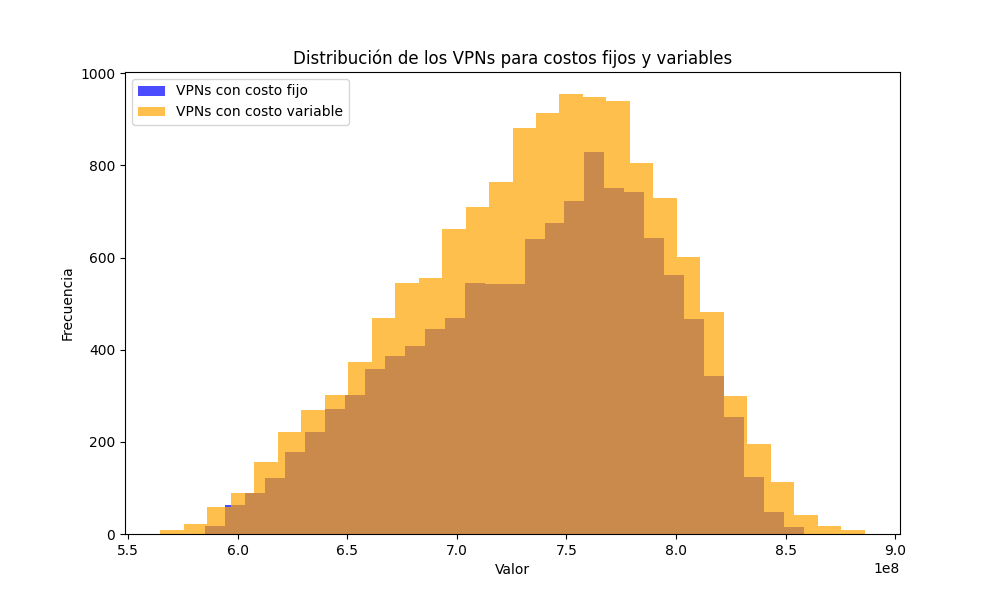

# Simulación del Flujo de Caja y Cálculo del Valor Presente Neto (VPN) para GF Auto Corporation

Este repositorio contiene un proyecto de simulación de flujos de caja para un nuevo modelo de auto de **GF Auto Corporation**, analizando su rendimiento financiero en los próximos 5 años. Se estima el Valor Presente Neto (VPN) de los flujos de caja después de impuestos, considerando distintas suposiciones de costos fijos y variables.

## Enunciado del Problema

GF Auto Corporation planea lanzar un auto compacto con un horizonte de ventas de 5 años. Los datos recopilados incluyen:

- **Costo de Desarrollo**: Se incurre al inicio del proyecto.
- **Margen de Ganancia**: La diferencia entre el precio de venta y el costo variable de producción (inicio en $4000, decremento de 4% anual).
- **Ventas Anuales**: Estimadas con distribución triangular (demanda inicial y decrecimiento anual).
- **Impuestos y Depreciación**: 40% de tasa corporativa e impuestos sobre depreciación lineal.
- **Tasa de Descuento**: 10%, que representa el costo de capital.

La simulación estima el **VPN** del proyecto bajo escenarios de costos fijos y variables y presenta un análisis de resultados con intervalos de confianza.

## Requisitos

A continuación se detallan las librerías necesarias para ejecutar el código.

| Librería          | Versión Requerida |
|-------------------|-------------------|
| Python            | 3.x               |
| NumPy             | Latest            |
| Matplotlib        | Latest            |
| Random            | Built-in          |
| Math              | Built-in          |

Puedes instalar las librerías con:
```bash
pip install numpy matplotlib
```
## Explicación del Código

El código se organiza en funciones para calcular ventas, depreciación, contribuciones, utilidades antes y después de impuestos, y el flujo de caja, terminando con la simulación del Valor Presente Neto (VPN). A continuación se describen las funciones principales y su propósito:

### Funciones Principales

| Función                           | Descripción                                                                                      |
|-----------------------------------|--------------------------------------------------------------------------------------------------|
| `margen(x)`                       | Calcula el margen de ganancia anual, disminuyéndolo en un 4% cada año.                          |
| `triangular(ei, moda, ed)`        | Genera un valor aleatorio usando una distribución triangular con valores mínimo, moda y máximo.  |
| `ventas(disminucion)`             | Calcula la cantidad de autos vendidos cada año con un decremento porcentual anual.               |
| `disminucionDemanda()`            | Genera un porcentaje de disminución de la demanda anualmente utilizando una distribución triangular. |
| `contribucion(margen, ventas)`    | Calcula la contribución anual como el producto del margen y las unidades vendidas.              |
| `depreciacion(tipoCosto)`         | Calcula la depreciación anual en 5 años, según el tipo de costo (fijo o variable).              |
| `utilidadAImp(contribucion, depreciacion)` | Calcula la utilidad antes de impuestos como la contribución menos la depreciación.    |
| `utilidadDImp(utilidadAntesImpuestos)` | Calcula la utilidad después de impuestos, aplicando una tasa del 40%.                     |
| `flujoCaja(depreciacion, utilidadDespuesImpuestos)` | Calcula el flujo de caja anual como la suma de la depreciación y la utilidad después de impuestos. |
| `valorPresenteNeto(flujoCaja, interes, periodos)` | Calcula el VPN utilizando el flujo de caja descontado al 10% anual.                  |
| `simularVPN(n, tipoCosto)`        | Realiza múltiples simulaciones de VPN bajo condiciones de costos fijos o variables.             |
| `calcularN(tipoCosto)`            | Calcula el número de simulaciones necesarias para lograr una precisión de ±$1,000,000.          |

### Resultados y Análisis

El código realiza los siguientes cálculos y análisis:

1. **Cálculo del Número de Simulaciones Requeridas**: Utiliza la desviación estándar de una muestra de 10,000 simulaciones para determinar cuántas simulaciones son necesarias para alcanzar una precisión de ±$1,000,000 en el cálculo del VPN.
2. **Cálculo del Intervalo de Confianza**: Genera el intervalo de confianza al 95% para el VPN bajo diferentes supuestos de costos fijos y variables.
3. **Histograma de Resultados**: Visualiza las distribuciones de VPN en un histograma, comparando los resultados entre los escenarios de costos fijos y variables.

### Ejemplo de Salida

```plaintext
De una muestra de 10000 simulaciones con costo fijo, la desviación estándar de dicha muestra es de:  55370386.977014005
El número de simulaciones requeridas es:  11777
IC 95% Inferior:  735358431.5423156
IC 95% Superior:  737374306.217542
La media para VPNs con costo fijo es:  736366368.8799288

De una muestra de 10000 simulaciones con costo variable, la desviación estándar de dicha muestra es de:  58480557.57168865
El número de simulaciones requeridas es:  13138
IC 95% Inferior:  735568767.9770379
IC 95% Superior:  737531668.1863151
La media para VPNs con costo variable es:  736550218.0816765
```
### Histograma de Distribución del VPN




